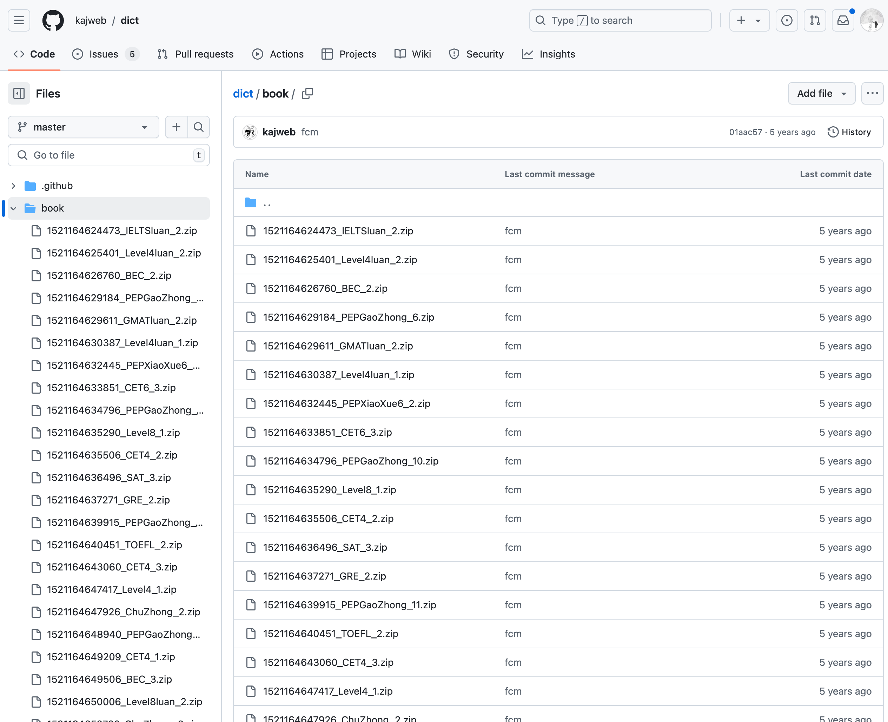

# [0003. qwerty-learner 英文单词数据源](https://github.com/tnotesjs/TNotes.en-notes/tree/main/notes/0003.%20qwerty-learner%20%E8%8B%B1%E6%96%87%E5%8D%95%E8%AF%8D%E6%95%B0%E6%8D%AE%E6%BA%90)

<!-- region:toc -->

- [1. github dict](#1-github-dict)
- [2. TNotes.en-words 数据来源说明](#2-tnotesen-words-数据来源说明)

<!-- endregion:toc -->

## 1. github dict

- https://github.com/kajweb/dict
  - github dict
  - 从这里边获取所有词典数据。
  - 

```bash
# 一共有以下这些 json 文件
.
├── BEC_2.json
├── BEC_3.json
├── BeiShiGaoZhong_1.json
├── BeiShiGaoZhong_10.json
├── BeiShiGaoZhong_11.json
├── BeiShiGaoZhong_2.json
├── BeiShiGaoZhong_3.json
├── BeiShiGaoZhong_4.json
├── BeiShiGaoZhong_5.json
├── BeiShiGaoZhong_6.json
├── BeiShiGaoZhong_7.json
├── BeiShiGaoZhong_8.json
├── BeiShiGaoZhong_9.json
├── CET4_1.json
├── CET4_2.json
├── CET4_3.json
├── CET4luan_1.json
├── CET4luan_2.json
├── CET6_1.json
├── CET6_2.json
├── CET6_3.json
├── CET6luan_1.json
├── ChuZhong_2.json
├── ChuZhong_3.json
├── ChuZhongluan_2.json
├── GMAT_2.json
├── GMAT_3.json
├── GMATluan_2.json
├── GRE_2.json
├── GRE_3.json
├── GaoZhong_2.json
├── GaoZhong_3.json
├── GaoZhongluan_2.json
├── IELTS_2.json
├── IELTS_3.json
├── IELTSluan_2.json
├── KaoYan_1.json
├── KaoYan_2.json
├── KaoYan_3.json
├── KaoYanluan_1.json
├── Level4_1.json
├── Level4_2.json
├── Level4luan_1.json
├── Level4luan_2.json
├── Level8_1.json
├── Level8_2.json
├── Level8luan_2.json
├── PEPChuZhong7_1.json
├── PEPChuZhong7_2.json
├── PEPChuZhong8_1.json
├── PEPChuZhong8_2.json
├── PEPChuZhong9_1.json
├── PEPGaoZhong_1.json
├── PEPGaoZhong_10.json
├── PEPGaoZhong_11.json
├── PEPGaoZhong_2.json
├── PEPGaoZhong_3.json
├── PEPGaoZhong_4.json
├── PEPGaoZhong_5.json
├── PEPGaoZhong_6.json
├── PEPGaoZhong_7.json
├── PEPGaoZhong_8.json
├── PEPGaoZhong_9.json
├── PEPXiaoXue3_1.json
├── PEPXiaoXue3_2.json
├── PEPXiaoXue4_1.json
├── PEPXiaoXue4_2.json
├── PEPXiaoXue5_1.json
├── PEPXiaoXue5_2.json
├── PEPXiaoXue6_1.json
├── PEPXiaoXue6_2.json
├── SAT_2.json
├── SAT_3.json
├── TOEFL_2.json
├── TOEFL_3.json
├── WaiYanSheChuZhong_1.json
├── WaiYanSheChuZhong_2.json
├── WaiYanSheChuZhong_3.json
├── WaiYanSheChuZhong_4.json
├── WaiYanSheChuZhong_5.json
└── WaiYanSheChuZhong_6.json
```

## 2. TNotes.en-words 数据来源说明

- [TNotes.en-words](https://github.com/Tdahuyou/TNotes.en-words) 中的单词数据也是基于 [dict](https://github.com/kajweb/dict) 来初始化的。
- 后续若有新增的词汇，再利用 AI 来生成同样结构的单词树数据，然后丢到 [TNotes.en-words](https://github.com/Tdahuyou/TNotes.en-words) 中即可。

```bash
git clone https://github.com/kajweb/dict
# 拉取 + 解析：
# 1. 把这个单词仓库数据全部 clone 下来
# 2. 自行编写一个简单的解析脚本提取单词卡片数据【解析脚本在当前笔记仓库中有记录】

# 示例 TNotes.en-words 中的词汇：
# - abandon
#   - 发音
#     - 英 /ə'bændən/
#     - 美 /ə'bændən/
#   - 词义
#     - vt. 离弃，放弃
#       - to leave someone, especially someone you are responsible for
#     - n. 放纵，放任
#       - if someone does something with abandon, they behave in a careless or uncontrolled way, without thinking or caring about what they are doing
#   - 记忆
#     - a + band(乐队) + on → 乐队解散， 放弃演出 → 放弃
#   - 同根词
#     - adj. abandoned 被抛弃的；无约束的；恣意放荡的；寡廉鲜耻的
#     - n. abandonment 抛弃；放纵
#     - v. abandoned 抛弃（abandon的过去式和过去分词）
#   - 近义词
#     - n. 狂热；放任
#       - loose
#       - mania
#     - vt. 遗弃；放弃
#       - desert
#       - yield
#       - quit
#   - 短语
#     - with abandon 恣意地，放纵地
#     - abandon ship 弃船
#   - 例句
#     - How could she abandon her own child? 她怎么能抛弃自己的孩子呢？
#   - 补充
```
